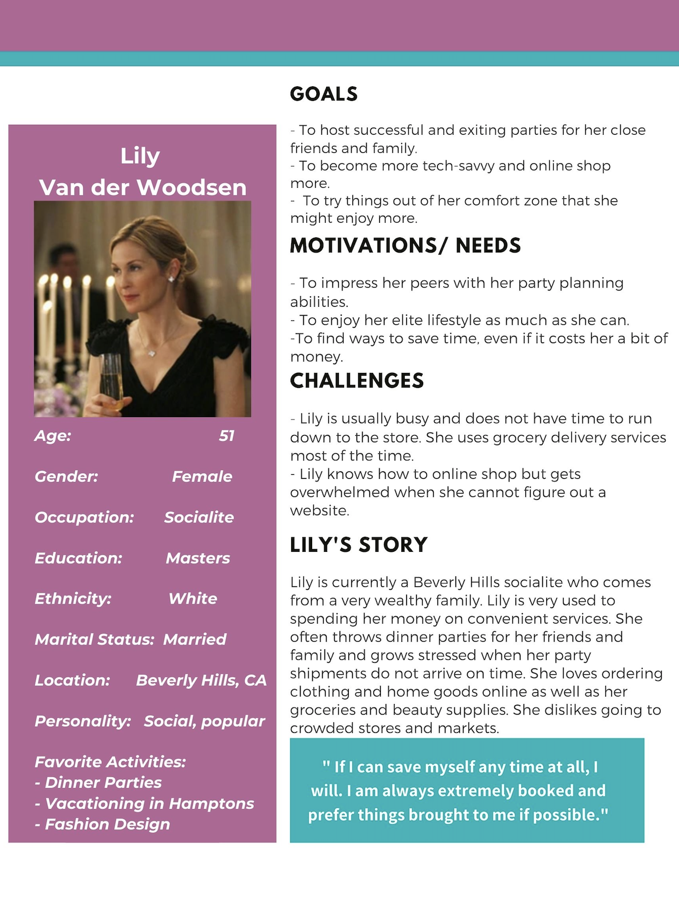
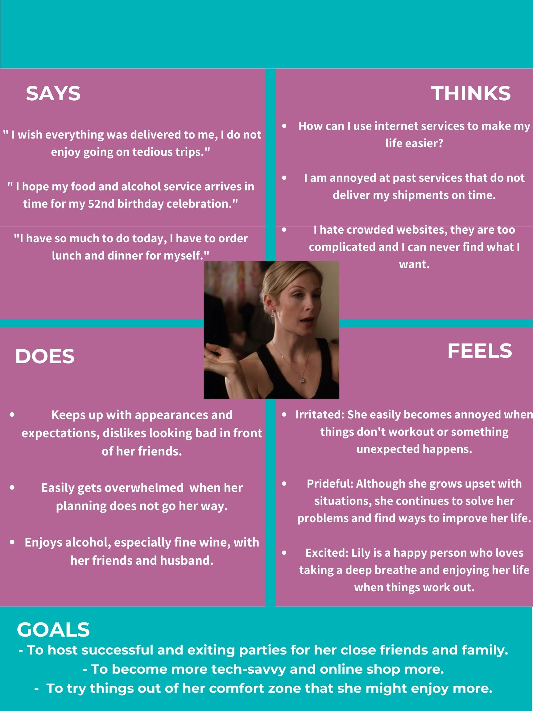
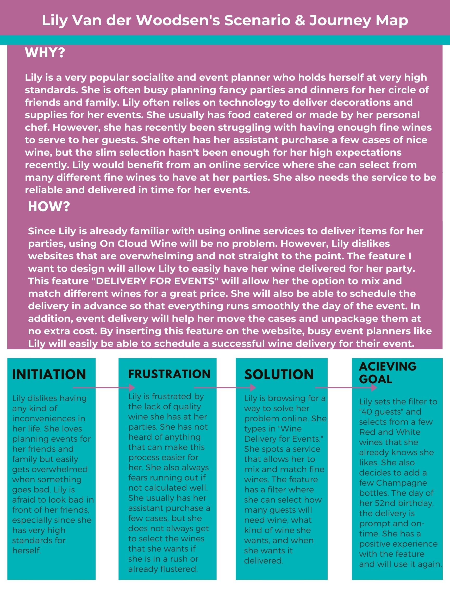
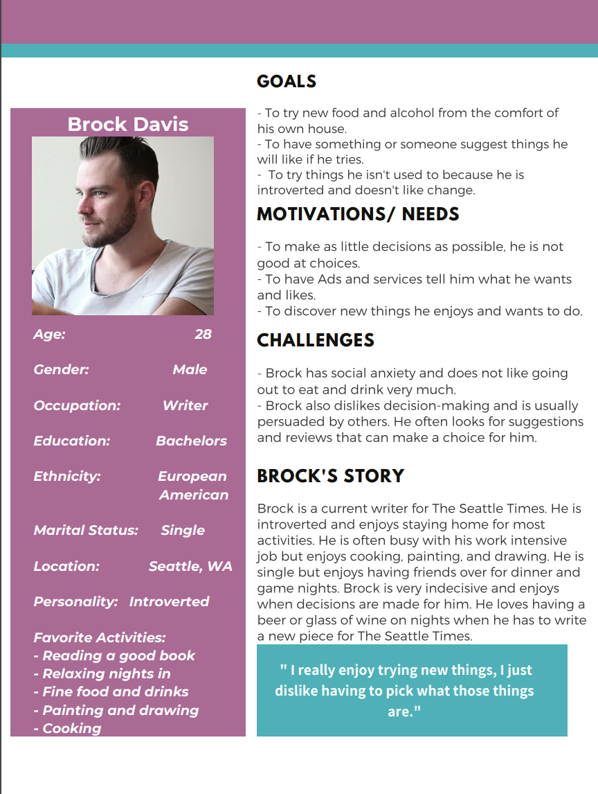
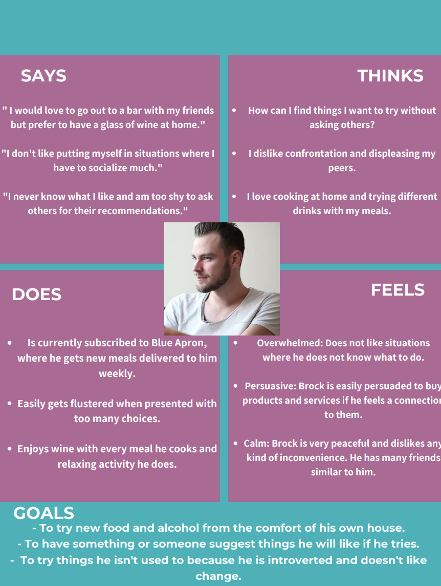
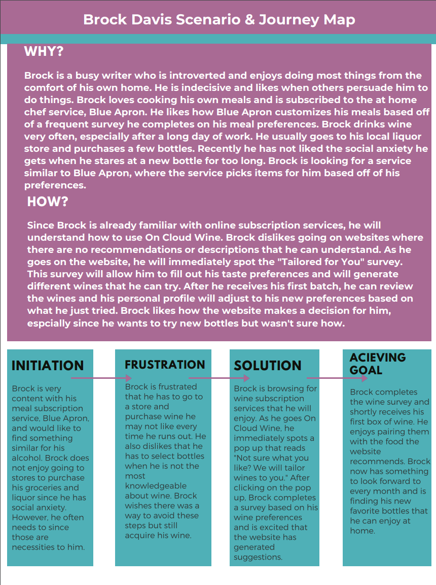

# Assignment 05: UX Storytelling
## The Purpose of UX Story telling
> ① By having Personas, we can understand the world of our users as if they are closer to us than they actually are.
We can put ourselves in someone else's perspective and design in a way that does not just favor our personal bias.

> ② UX Storytelling gives us a fresh set of eyes to understand and explore the world of UX.

> ③ Empathy Maps and Scenarios allow us to articulate and visualize what we know about the user we are designing for. It is a helpful tool when deciding the trade-offs of a design.

## Features of Design to Improve:
> 1. Event Delivery Option with Filters

> 2. Personalized Monthly Quiz with Recommendations 

## Persona & Empathy Maps 

## Persona 1: Lily Van der Woodsen

## Lily's Scenario & Journey Map

## Persona 2: Brock Davis

## Brock's Scenario & Journey Map

## Reflection
> The process of coming up with Personas and Empathy Maps was very interesting. I had a fun time creating these people that gave me a new design perspective. I really enjoyed coming up with the small details, it made their profile more realistic.
> I hope next time I am better prepared to create interesting personas, especially now that I have had practice. One challenge I will address is uploading my visualizations. I was able to design the maps well, but they did not appear as high quality as I designed them. Hopefully I can find a better way to upload them in the future.
