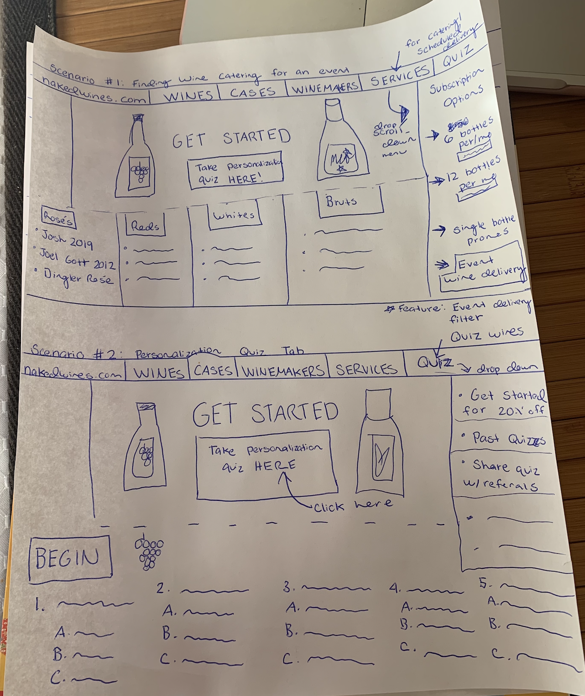
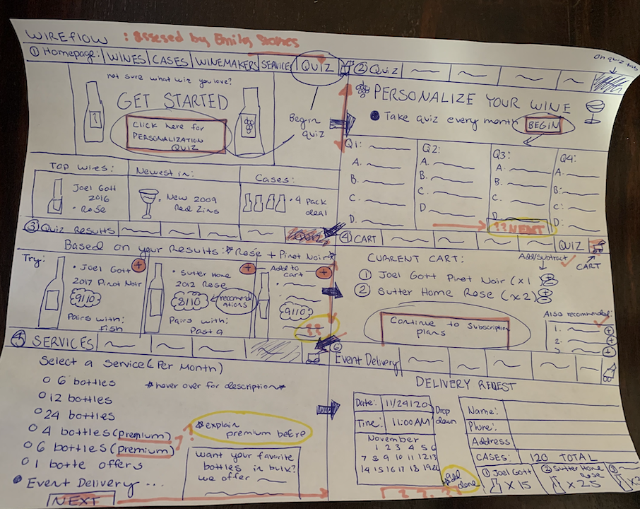

# Assignment 06: Low-Fidelity Prototype

## Project Description
### Purpose:
>This project aims to solve any user challenges that may arise when signing up for a wine subscription service.
I want to find whether or not the features I have designed help the process run more smoothly and promote user satisfaction. The features I have designed 
to improve a wine subscription service are as follow:

### User Personas:
> The target audience for my product are middle-aged women who are looking for products and services that make them happy. 
However, I am also targeting users who love wine and would benefit from an online service. Targeted users understand how to use technology and the internet, but want an accessibility friendly website. Based on my user research, users enjoy websites that are simple understand, answer their questions before they are asked, and are not too challenging to navigate. Users want a solid solution for their problem and do not wish to work harder on an internet solution than they would by purchasing their wine in store.

### Features and Tasks:
> 
##### 1. Personalization Quiz Tab 
> Users will immediately spot the "Personalization Quiz" tab on the upper right hand side of the website. By spotting this tab, users will
take their wine quiz and unlock their preferences and a discount. The tab will stand out from the other menu options since it is essentially one of the
most important. The task is to find a way to personalize wine to the user's liking, especially if they rely on recommendations for purchases.

##### 2. Event Delivery Filter
> For users who are looking for a service that caters for their events and gatherings, the event delivery filter will be present. When filtering through wine subscription packages (e.g. 6 per month/ 12 per month/ etc.), users will 
find a filter that allows them to set up a scheduled wine delivery. The filter will appear when users select their service, but will be promoted under the services tab. 
The task is to find wine delivery for an event, preferably a scheduled one where the user can select different wines.

##### 3. Recommendation Meter 
> Reviews and recommendations can make or break a product, the user needs to have easy access to them. Next to every bottle of wine, there will be a recommendation meter that provides the average reviews on a ratio scale of 1-10. By limiting the reviews to a ratio scale instead of stars or percentages, the reviews will be more straightforward for the user. The task is to find a bottle or two that have a meter score of 8 and above.

More information about user personas can be found [HERE](https://github.com/natalidelgadillo/DH150-NATALIDELGADILLO/blob/main/Assignment%2005/README.md).

### Wireframes 

> Wireframes PDF can be found  [HERE](https://docs.google.com/document/d/1BStsFFZ4bYWEO2oJd55VYmL9byiCq10f3kRtMSU1RIw/edit?usp=sharing). Also below:

>
> 
>
>> 

### Wireflows
> Wireflows below: 

> 

### Prototype Testing
> Testing Wireflow on User, Emily Stokes.
>> 

### Reflection

