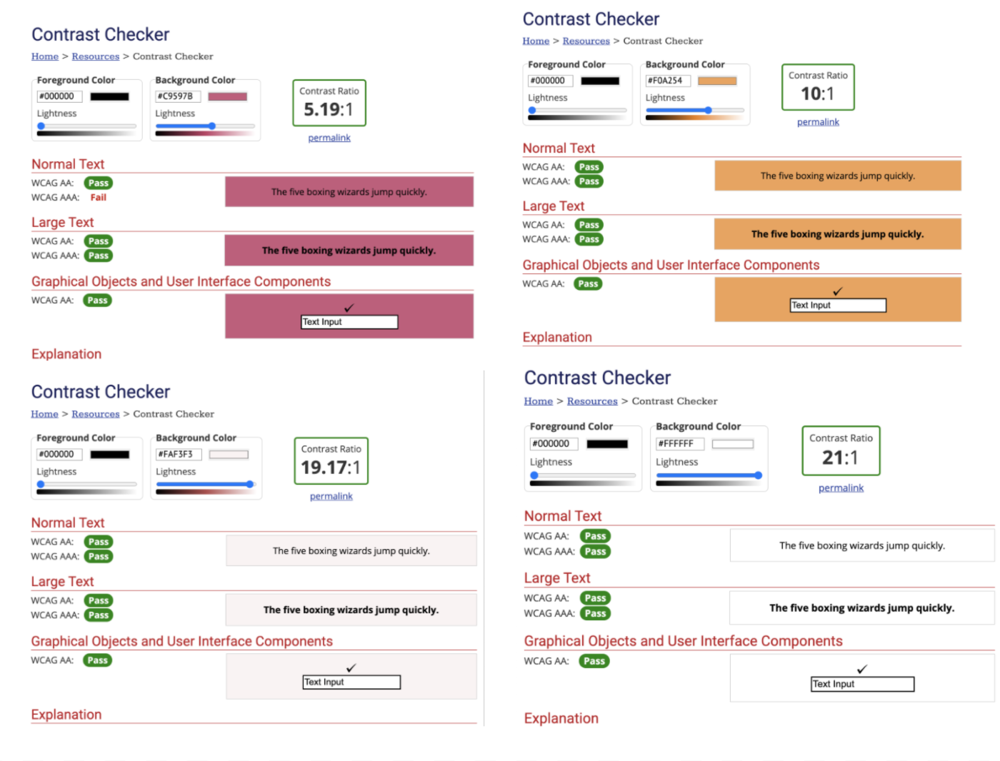

## Assignment 07: High Fidelity Prototype
### Description of Project

>  For this protytpe, I am building a website where consumers can purchase fine wines from the comfort of their own homes. 
My website is designed to make the online shopping experience as seemless and enjoyable as possible, even if a consumer is not very technologically experienced. I have also incorporated a few features tailored to a specific kind of consumer, a personalization quiz and event delivery service.
The graphic design of my page features a color palette inspired by the different array of wines that inspired this project. From a Merlot magenta to a soft orange resembling moscato, the colors tell a story of their own. I have also selected icons and images
that are clear and not difficult to understand. The icons are modeled "lineraly" and are all cohesive with each other throughout the pages. I have currently digitalized my wireframes to match the personal scenearios from the previous weeks.

### Impression Test
> Link to video: https://drive.google.com/file/d/11TbFCrTXQNf4SWT1B092-hQ52aXuuBR2/view?usp=sharing

#### Summary of Impression Test: 
> For the Impression Test of my prototype, I walked my user through my wireframes and asked about the design of the pages. Tara immediately expressed interest in the color scheme of the site and the design of the logo. When asked if the background of the site was distracting, she stated that it was blurred enough to not be a distraction when viewing the website. Tara also noticed the correlation between the wines and the colors of the website. After showing her the homepage, I navigated her through the quiz function to get feedback on the layout. She expressed liking the clarity of the text and the contrasting colors. I then showed her the results and check out pages. Tara enjoyed the transition buttons and how easy the cart icon was to find. Again, she continued to express interest in the colors and the icons on the different pages. She also enjoyed the large icons of the wines and the circular aesthetic. 

### Color & Accessibility Check

> When creating my protoype, I wanted to select a color palette that resembled the idea behind my design. When purchasing items, it is nice to have a color scheme that reminds you of what you are purhcasing. To find colors similar to that of an array of different wines, I used Adobe Color. With Adobe color, I found the perfect shades of orange and magenta that would fit the aesthetic design of my website. Before applying my colors, I made sure to test the color contrast for accessibility WCAG2.0 AA level. I used 5 colors for my design: Black (#1C1515), Light Orange (#F0A254), White (#FFFFFF), Light Magenta (#C9597B), and Light Pink (#FAF3F3). My colors all pass the ratio guidelines and the meet the accessibility AA level.

