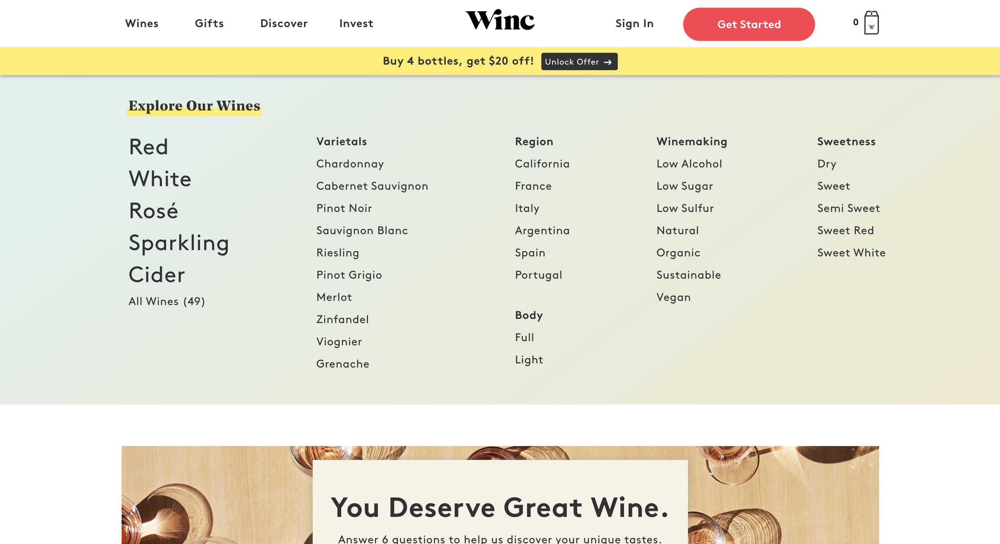
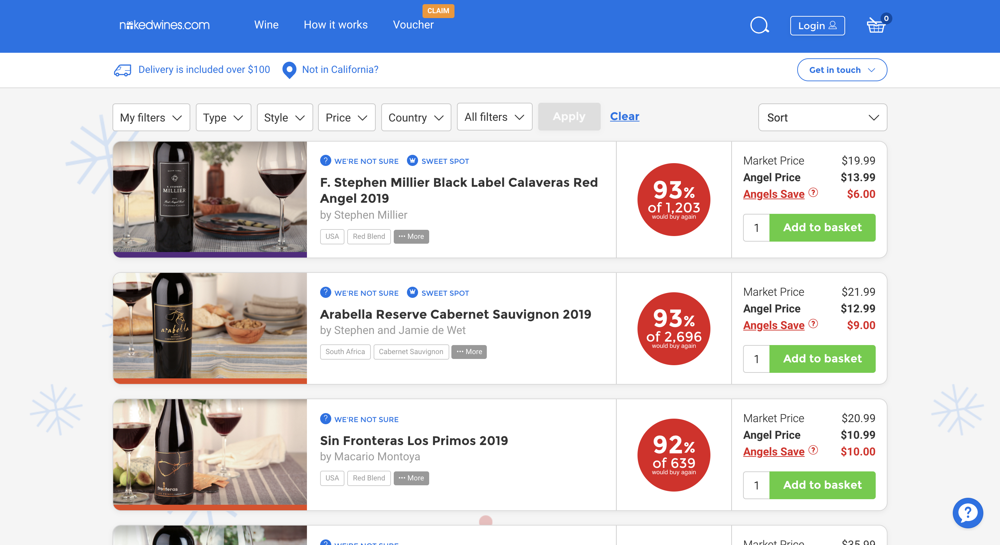
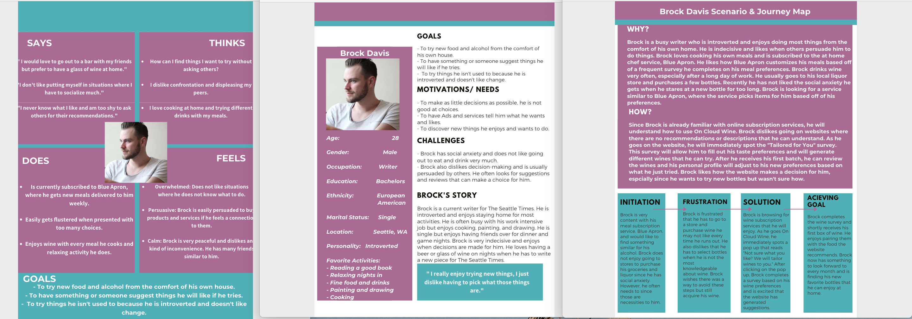
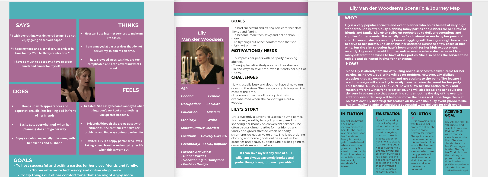

# The Perfect Bottle of Wine: On Cloud Wine

## By Natali Delgadillo

### Introduction 
> *On Cloud Wine* is an online wine subscription service that facilitates the process of sampling and purchasing different kinds of wines on a monthly basis. It allows the user to purchase a variety of wines and have them easily delivered to their doorstep. The target users of the service are those who may be too busy to find their favorite wines or simply want a simpler alternative to going to the grocery store every time they need wine. After conducting user research, a personalization quiz, event service, and ratings meter would benefit the overall user experience of the wine shopper. 

### Design Statement

> My design's purpose is to bring joy to middle-aged women who enjoy wine but may not know what their favorite bottle is or may not have time to purchase wine. Wine tasting is a universally enjoyable experience, but may be out of reach for those who do not live near a vineyard or do not have the resources to experience it. On Cloud Wine allows users to try different wines every month based on their personalization quiz. My project also aims to make the wine selection process simple and enjoyable for the user, with many recommendations and different categroies clearly labeled. Users do not need to be the most technologically advanced to be able to navigate the website and understand the different types of wine subscription services that there are. I believe my subscription service combines the idea of online shopping with convenience and the excitement of trying new items every month.

### Competitor Analysis: Heuristic Evaluation

> In order to improve features in the design of my project, I analyzed the user experience designs of other wine subscription service websites. From my research, I found two top online sellers, Winc and Naked Wines. By improving UX design, the sites would allow for an easier, more personal experience to those seeking to find their favorite wine. I found both websites offer a very differnet approach but integrate similar features. Through this heuristic evaluation, I explored the positives and negatives of my competitors' designs and user features.

| Winc | Total Wines |
| ------------- | ------------- |
|  |   |

See the complete evaluation [here.](https://github.com/natalidelgadillo/DH150-NATALIDELGADILLO)

### Competitor Analysis: Usability Testing

> The purpose of a usability test (UT) is to identify and fix any usability issues that a user may encounter. It is essential to ensure that a user can use and navigate a website, application, or product. UT allows the designers to identify issues from a heuristic evaluation that may be fixed to improve the user experience. By directly identifying the challenges a user may experience during a recorded session, the correction process is made much simpler. The UT assessed three metrics of usability: effectiveness, satisfaction, and efficiency.  For the test, I inserted a pre-test questionnaire that measured the user's initial perception of the Naked Wines website. After the pre-test, I walked the user through three tasks that required their exploration and interactions with the Naked Wines website. After the user completed the tasks, a post-test questionnaire measured their experience navigating the website. It surveyed their experience, ease with navigation, and personal likelihood of repeating a task. The SUS, or System Usability Scale, followed the post-test questionnaire. 

View the full usability testing [here.](https://github.com/natalidelgadillo/DH150/tree/main/ASSIGNMENT2)

### User Research: Contextual Inquiry
> After conducting a heuristic evaluation, I identified my target users and conducted an interview. The observation methods I used were participatory observation and interview. I had my participant search for wine online and asked questions based off of their wine purchasing habits. Looking into her interests and preferences gave me a fresh intake of online shopping versus shopping in person. It was also important to note that the COVID-19 questions could have gone either way. Her answers helped understand how a busy student who has anxiety about the going to stores feels about shopping for their favorite goods in store. 

See the complete documentation of contextual inquiry [here.](https://github.com/natalidelgadillo/DH150-NATALIDELGADILLO/blob/main/Assignment04/README.md)

### UX Storytelling
> By having Personas, we can understand the world of our users as if they are closer to us than they actually are.
We can put ourselves in someone else's perspective and design in a way that does not just favor our personal bias. UX Storytelling gives us a fresh set of eyes to understand and explore the world of UX. Empathy Maps and Scenarios allow us to articulate and visualize what we know about the user we are designing for. It is a helpful tool when deciding the trade-offs of a design.

#### Key Features in Design:
> 1. Event Delivery Option with Filters

> 2. Personalized Monthly Quiz with Recommendations 

> 3. Ratings Meter

> 
> 

View the full personas and scenarios [here.](https://github.com/natalidelgadillo/DH150-NATALIDELGADILLO/edit/main/Assignment%2005/README.md)

### Low-fidelity Prototype

My low-fidelity prototype aims to solve any user challenges that may arise when signing up for a wine subscription service.
I want to find whether or not the features I have designed help the process run more smoothly and promote user satisfaction. The features I have designed 
to improve a wine subscription service are as follow:

#### Features and Tasks:
> 
##### 1. Personalization Quiz Tab 
> Users will immediately spot the "Personalization Quiz" tab on the upper right hand side of the website. By spotting this tab, users will
take their wine quiz and unlock their preferences and a discount. The tab will stand out from the other menu options since it is essentially one of the
most important. The task is to find a way to personalize wine to the user's liking, especially if they rely on recommendations for purchases.

##### 2. Event Delivery Filter
> For users who are looking for a service that caters for their events and gatherings, the event delivery filter will be present. When filtering through wine subscription packages (e.g. 6 per month/ 12 per month/ etc.), users will 
find a filter that allows them to set up a scheduled wine delivery. The filter will appear when users select their service, but will be promoted under the services tab. 
The task is to find wine delivery for an event, preferably a scheduled one where the user can select different wines.

##### 3. Recommendation Meter 
> Reviews and recommendations can make or break a product, the user needs to have easy access to them. Next to every bottle of wine, there will be a recommendation meter that provides the average reviews on a ratio scale of 1-10. By limiting the reviews to a ratio scale instead of stars or percentages, the reviews will be more straightforward for the user. The task is to find a bottle or two that have a meter score of 8 and above.

### Wireframe and Graphic Design Element Variation

### High-fidelity Prototype

### Evaluation and Revision History

### Pitch Video

### Conclusion
