# DH150-NATALIDELGADILLO
## The Perfect Bottle of Wine
### Natali_Delgadillo

----------

### Wine Tasting Subscription Services
> For this assignment, I want to analyze the different kinds of wine tasting subscription services offered online. My college friends and I have recently picked up a passion for red wine, peaking my interest in easy and affordable subscription services. In addition, many middle aged women in my life find happiness in the perfect glass of wine. From colorful reds to dry whites, the ideal glass of wine is not easy to find. Not only is every bottle of wine different in their type, but every individual prefers different blends. From my research I found two top online sellers, Winc and Naked Wines. By improving UX design, the sites would allow for an easier, more personal experience to those seeking to find their favorite wine. 

### Severity Scale for Usability Problems  
Rating | Assessment
------------ | -------------
1 | Cosmetic problem only: need not be fixed unless extra time is available on project
2 | Minor usability problem: fixing this should be given low priority
3 | Major usability problem: important to fix, so should be given high priority

Source: https://www.nngroup.com/articles/how-to-rate-the-severity-of-usability-problems/

### Heuristic Evaluation of Website - WINC Wine Subscription Service 

https://www.winc.com/wines

> Winc is an online wine subscription service that allows you to try different kinds of wines every month. Winc connects you to a world of exclusive wines tailored to your preferences. When first joining, the website prompts you with a few starter steps. First, you answer 6 questions based on your existing wine preferences. After answering the questions, Winc recommends a few bottles that you may enjoy. After your first delivery, you rate the bottles to better customize your future deliveries. Winc has a minimal design and allows you to browse their wide variety of wine selections. The navigation features 5 selections: Profile, wines, gifts, discover, and invest.

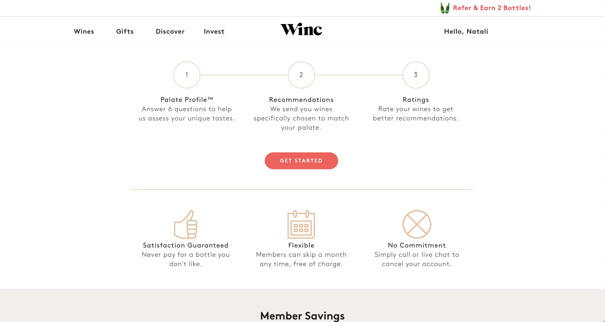

### Initial Evaluation
> Winc has an easy to navigate, minimalist website from first impression. It is easy to find the main categories that would be most important to have on a wine subscription website. The very first page shows all of the different wines that they have and categorizes them by winemaking and even sweetness. It is slightly overwhelming how many options there are and how they are all layed out at once. As you scroll down, there are top rated wines and more categories to explore, somewhat repetitive.

### #1 Visibility of System Status   
Rating | Assessment
------------ | -------------
1 | When a user hovers over the main 5 categories, "Invest" does not light up the same way that the others do.
2 | When adding an item to the shopping cart, the user does not get notified that the item has been added. The user must look at the shopping cart to see their item number increase.

### #2 Match between System and Real World   
Rating | Assessment
------------ | -------------
1 | Membership terminology is scattered out and not cohesive (e.g. regular price vs W members on products).
1 | Some terminology may be unclear to different age groups. The meaning of "hip" language is not immediately clear (e.g. Bev).
2 | Wine terminology may not be understood by new users. While most of the terms are common, certain ones could benefit from a small explanation when the user hovers over the word (e.g. body).

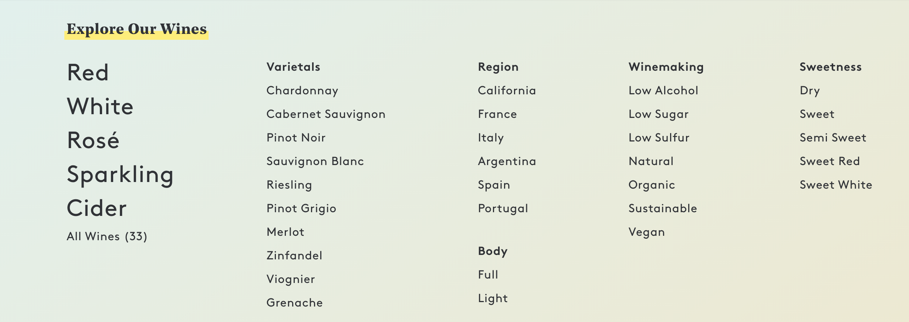

### #3 User Control and Freedom   
Rating | Assessment
------------ | -------------
1 | User loses place in list when clicking back and forth between wines.
2 | Cannot easily undo any items that have been accidentally removed from shopping cart. In addition, user cannot easily remove items accidentally added to shopping cart.

### #4 Consistency and Standards   
Rating | Assessment
------------ | -------------
1 | Some products do not have titles. You must click on the photo to learn the name of the wine.
2 | No arrows to scroll through wines, user must click on circles below widget to switch pages.
2 | Certain wine categories are redundant and appear multiple times per page.
3 | User is not provided with an easily accessible search bar. Difficult to locate desired item immediately by name or company since there is no search bar.

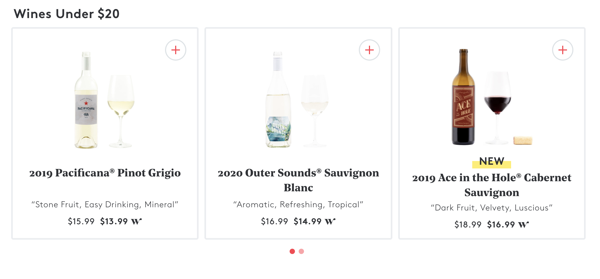

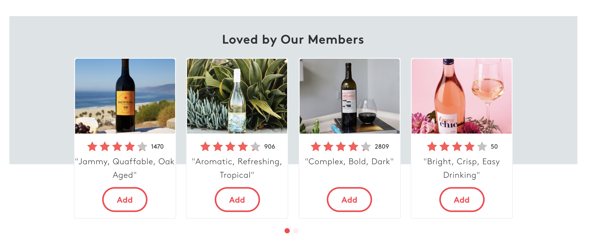

### #5 Error Prevention   
Rating | Assessment
------------ | -------------
1 | User is not warned if more than one of the same wine is added more than once. The user could accidentally buy the same product multiple times without a warning.
1 | When registering, there is no double confirmation of password. Some websites ask the user to input their passwords twice to limit error.
2 | There is no warning if the user clears out their saved wines, Winc simply clears the selections.

### #6 Recognition rather than Recall   
Rating | Assessment
------------ | -------------
1 | User is not given explanations of why added wines are similar to the recommended ones.
2 | User does not have option to filter exact flavors and ingredients.
2 | User does not have option to select a specific year of wine.
3 | User does not have option to look through items from the same wine supplier. User must remember the name and scroll to find the similar products. 

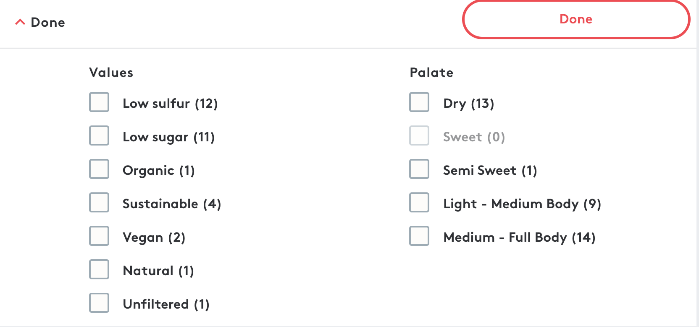

### #7 Flexibility and Efficiency of Use  
Rating | Assessment
------------ | -------------
2 | The "buy 4 bottles, get $20" promotion is not clear and is not clickable. It is not clear that it will be later applied without a code. Could be improved by a small "applied at checkout".
2 | Ratings under wines could be improved to make page less cluttered. Instead of having both the stars and the point ratings, having only one would convey the same message. 
3 | Product prices are displayed in two categories: With and without Winc. These side by side price comparisons make the section look cluttered and overwhelming. It would be better for the user if only one price appeared for the display and the second popped up when hovered over the product. 

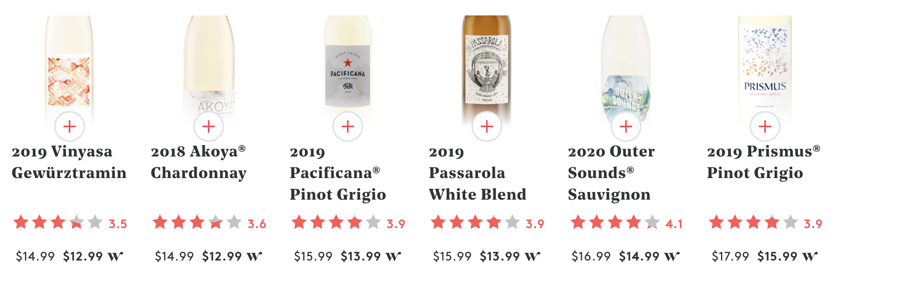

### #8 Aesthetic and Minimal Design
Rating | Assessment
------------ | -------------
2 | Too much italicization and boldness in headings and descriptions. At times difficult to focus on one aspect of the wine in the display since multiple things are being highlighted.
2 | Product photos on website are not the most cohesive. Certain combinations of product are not edited with the same filter, background, aesthetic, etc. making it difficult to focus on one single wine.
3 | Redundant prices and ratings. Multiple accounts of the same concept are not necessary (e.g. two icons representing ratings)

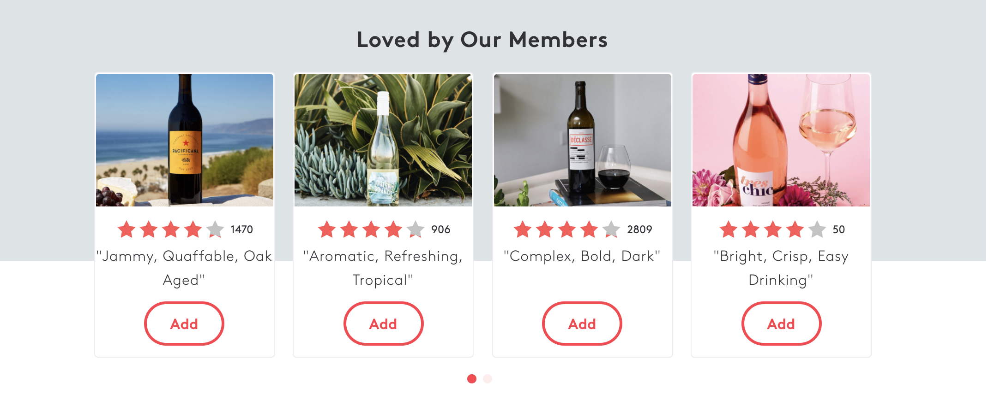

### #9 Help Users Recognize, Diagnose, and Recover from Errors  
Rating | Assessment
------------ | -------------
2 | When checking out, gives user error message that a certain amount of product must be added to purchase the subscription box. Would be better if told users before moving to checkout page.
2 | When applying search filters, user can combine filters and now know which is out of stock. Needs an error message under specific filter.

### #10 Help and Documentation 
Rating | Assessment
------------ | -------------
3 | No search bar present at all. The website needs a search bar to help users navigate products and find the items they want to purchase. The filters are helpful but do not allow the user to pinpoint exactly what they want.
3 | Support is difficult to find. User must scroll to the bottom of the page to find help or FAQs.

### Heuristic Evaluation of Website - Naked Wines Wine Subscription Service 

https://us.nakedwines.com/full_site

> Naked Wines is very similar to Winc in that it is a wine subscription service. Their wines come from independent wine makers and support many local vineyards. Naked wines has a wide selection of wine boxes and individual wines. A $100 voucher is offered when a user wants to try it for the first time. Also similar to Winc, the user takes a wine quiz to learn about their thoughts and preferences.

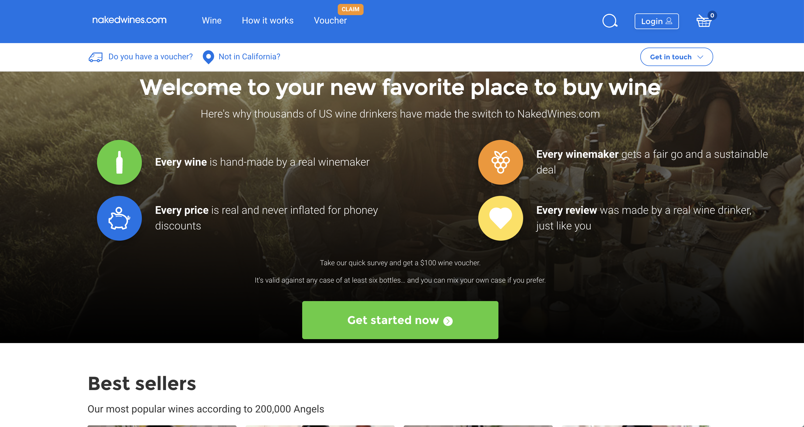

### Initial Evaluation
> Naked Wines does not have the most minimal website design, it is quite overwhelming when first processing the page. On the home page, there is a prompt asking the user to take a wine survey in exchange for a voucher. As the user scrolls down the page, there are different wine categories saturated with wines of all kinds. The top menu is very simple and only has 4 categories: wine, how it works, voucher, log in. The extensive amount of options at first sight is my least favorite part of this website.

### #1 Visibility of System Status   
Rating | Assessment
------------ | -------------
1 | When a user hovers over wine titles and descriptions, multiple things can pop up at once. It is distracting and doesn't notify user of system status.
1 | Notifies user when item is placed in cart. Could be improved by including less details in the pop up, making it easier to digest.
2 | Many actions require a "sign up" or account. Users should be able to navigate and know the status of their commands without the pop up distracting them.
3 | User cannot click on the categories listed on the home page when it appears that you can. Very misleading and difficult to understand how to get to category without directly clicking on it.

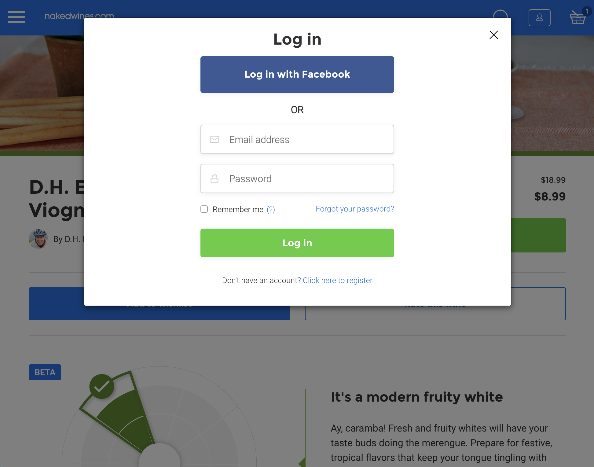

### #2 Match between System and Real World   
Rating | Assessment
------------ | -------------
1 | Selling terminology and categories are similar and redundant at times, could confuse the user (e.g. best offers & best sellers). 
1 | Some colorful terminology may be difficult to digest. This website features words that are very uncommon and not generally known by the average person (e.g. scintillating).
2 | Wine terminology may not be understood by new wine users. While most of the terms are common, certain ones could benefit from a small explanation when the user hovers over the word.

### #3 User Control and Freedom   
Rating | Assessment
------------ | -------------
1 | Users may accidentally click on the question mark button above the preview of a wine and be redirected to another page. Would be easier for the user if the question mark featured a pop up instead of a redirection. 
2 | Users cannot easily undo any added items if they accidentally click on the price of the wine. Although the button changes from price to "add", it may still be misleading to users.
3 | When the user is working on their introductory survey to claim their promotional voucher, they cannot exit the page or return to the previous page without starting the survey over.

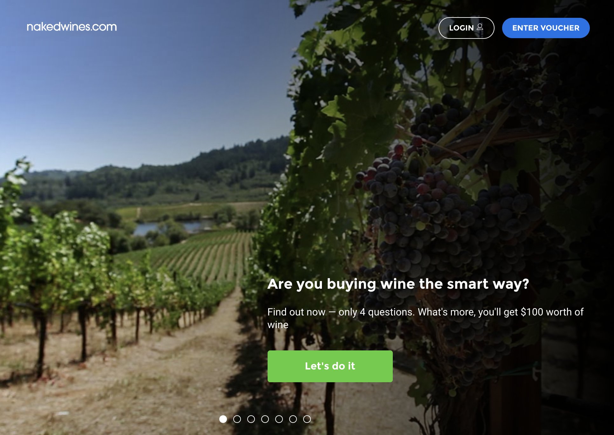

### #4 Consistency and Standards   
Rating | Assessment
------------ | -------------
1 | Arrows used to scroll through wines disappear after two rows. Would be useful if they did not disappear and instead displayed the items carousel style (e.g. Netflix's scrolling feature).
2 | Much emphasis is placed on the voucher system but it is not consistent throughout website. Unclear whether a user must take the initial survey or simply put in their email to unlock the promotion.
2 | Subcategories seem as though they can have the same meaning. No clear difference between "groups," "winemakers," and "angels". Would be useful to insert short description when user hovers over the category.
3 | Question mark icon and "we're not sure" subheading is very confusing and may dissuade the user. Although it is refering to not being sure if it is the type of wine you will like, the placement and wording is confusing.

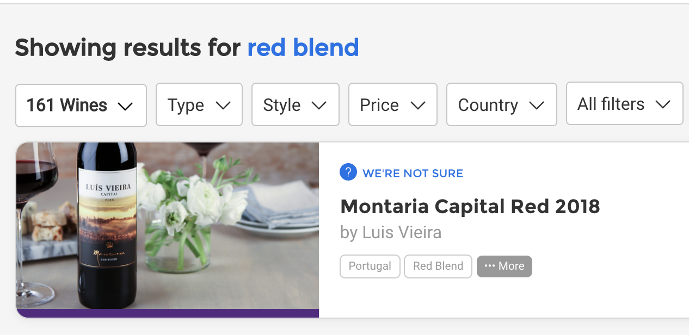

### #5 Error Prevention   
Rating | Assessment
------------ | -------------
1 | User does not get warning if shopping cart is accidentally cleared.
3 | Website allows the user to add items that are out of stock and later removes them from the cart with an error message. Can be misleading and confusing for the user.

### #6 Recognition rather than Recall   
Rating | Assessment
------------ | -------------
2 | User does not have option to select exact ingredients.
2 | User does not have option to select organic and vegan options. If there is a diertary restriction that the user has, could be a big problem for the sellers of the wine.
2 | User does not have option to select a specific year of wine.
3 | Under every category, the wines are not displayed in any particular order for the user. It is difficult for the user to easily differentiate between the winemakers since many are repeated in an odd order (e.g. Miller 2019 is listed first, Sharon 2010 is listed second, and Miller 2020 is listed 3rd) Grouping the wines by winemaker or at least in order would be helpful.

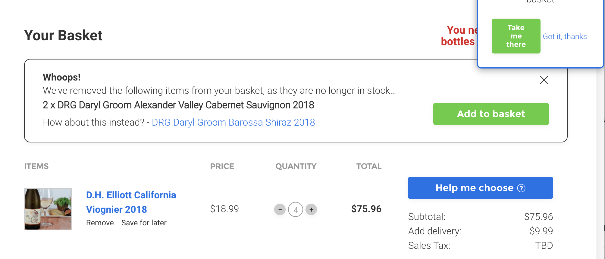

### #7 Flexibility and Efficiency of Use  
Rating | Assessment
------------ | -------------
2 | Wine beginners may be confused by the different badges and labels that the wines have in just the preview. The preview should be shorter and the description should feature all the additional badges.
2 | Ratings for each wine clutter the page and are not very useful. The large red dot next to the prices could be changed, the user does not need to see every single number.
3 | The product prices are displayed in three categories: market price, angel price, and angel saving. The three categories are overwhelming to have stacked on top of each other. It would be best to have an "advanced savings" button to see how all the prices compare.

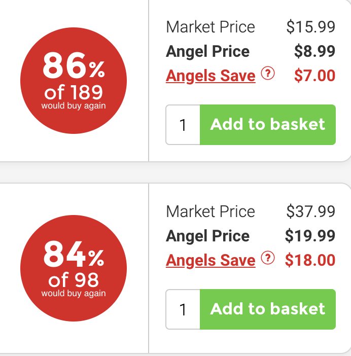

### #8 Aesthetic and Minimal Design
Rating | Assessment
------------ | -------------
2 | Website has primary colors and very dull design. Looks very poorly made and could use new fonts. Also appears outdated and not modern.
2 | On the home page, mixing wines with wine merchandise is very confusing to the eye. Both displays look similar and showcase wine. 
2 | Pop ups are very crowding and redundant. They should not appear so often as the user browses, especially the voucher pop ups.
3 | Very distracting rating and price display. All the details should not be immediately displayed, it gives the user too much content to take in.

### #9 Help Users Recognize, Diagnose, and Recover from Errors  
Rating | Assessment
------------ | -------------
2 | Error message is presented to the user when a wine is out of stock. Misleading that the user can add it, should have warning before user clicks on the preview.
2 | Error message should be flashed when user accidentally clicks out of the survey. If user is far in the survey, may be difficult to start again.

### #10 Help and Documentation 
Rating | Assessment
------------ | -------------
1 | Live chat option needs a "proceed" option before it immediately connects you to a customer service agent. Very abrupt and intimidating if the user were just browsing the page.
2 | "How it Works" section is very helpful but slightly crowded and redundant. Anything the user may easily know or find in other parts of the page should be removed.
2 | Help and FAQs are difficult to find. User must scroll to the bottom of the page past many rows of content to find help. However, "Get in touch" button at the top of the page is well placed.
